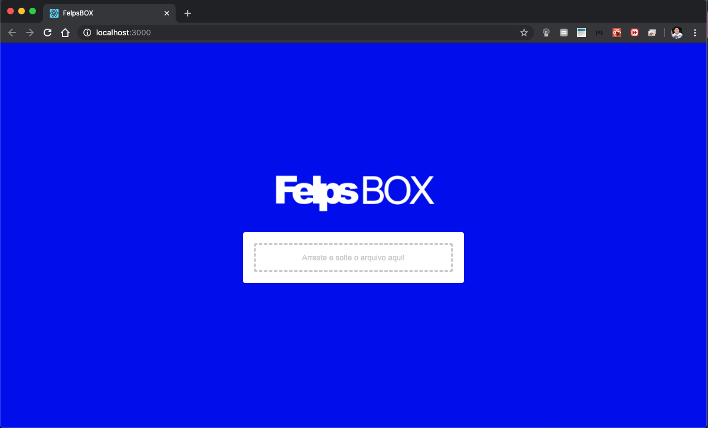
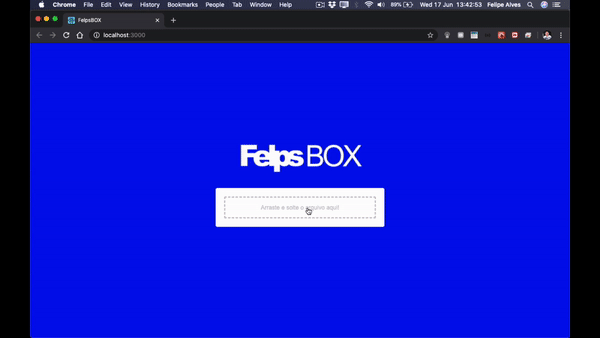

<p align="center">
  


  <h2 align="center">FelpsBOX</h2>

  <p align="center">
    <br />
    <small>My personal file list in Cloud!</small>
    <br />
  </p>
</p>


## Contents

- [Contents](#contents)
- [About The Project](#about-the-project)
  - [Built With](#built-with)
- [Getting Started](#getting-started)
  - [Installation](#installation)
- [Contributing](#contributing)
- [Screenshots](#screenshots)
- [Contact](#contact)


## About The Project

<p align="center">
  
</p>

My personal file list in Cloud!
<br />


### Built With

* [React-Native](https://github.com/facebook/react-native)
* [React Native Vector Icons](https://github.com/oblador/react-native-vector-icons)
* [React Navigation](https://reactnavigation.org/)


## Getting Started

To get a local copy up and running follow these simple steps.


### Installation
 
1. Clone the repo
```sh
git clone https://github.com/felipealvescosta/upload-file-frontend.git
```
Run Project
<br/>
1. Enter the server folder
```sh
cd upload-file-frontend 
yarn install 
yarn start
```

## Contributing

Contributions are what make the open source community such an amazing place to be learn, inspire, and create. Any contributions you make are **greatly appreciated**.

1. Fork the Project
2. Create your Feature Branch (`git checkout -b feature/AmazingFeature`)
3. Commit your Changes (`git commit -m 'Add some AmazingFeature'`)
4. Push to the Branch (`git push origin feature/AmazingFeature`)
5. Open a Pull Request

## Screenshots

<p align="center">
  
</p>


## Contact

[Felipe Alves](https://felipealvescosta.com) - [LinkedIn](https://www.linkedin.com/in/felipealvesdacosta/) - [GitHub](https://github.com/felipealvescosta)